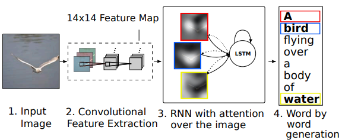
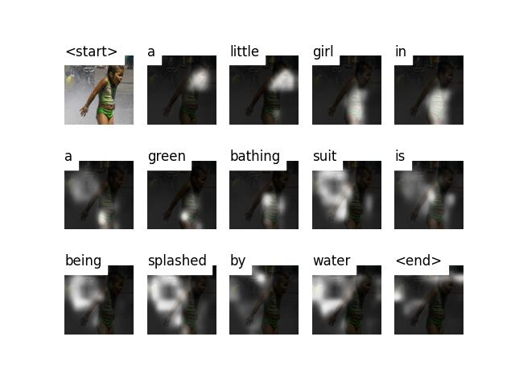
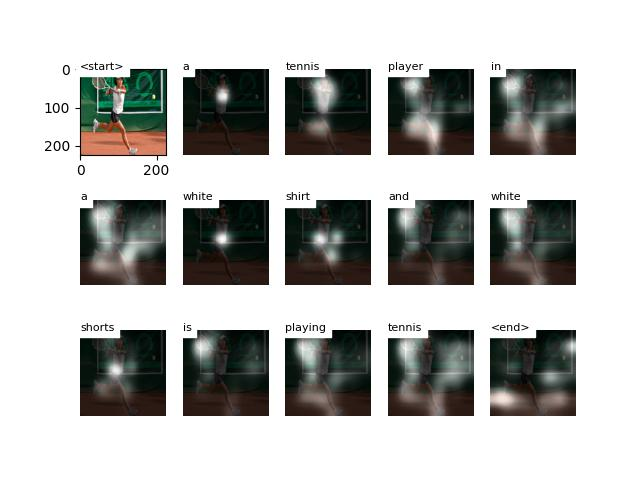
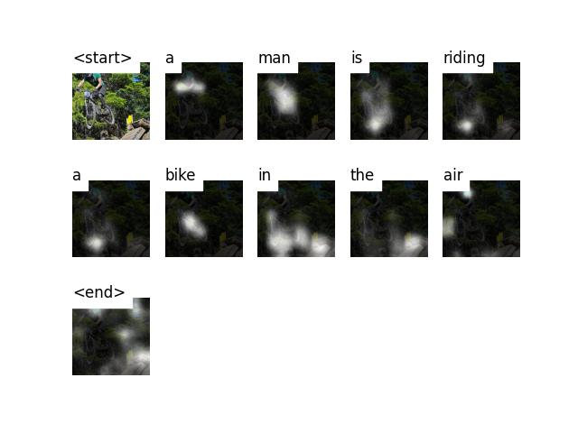
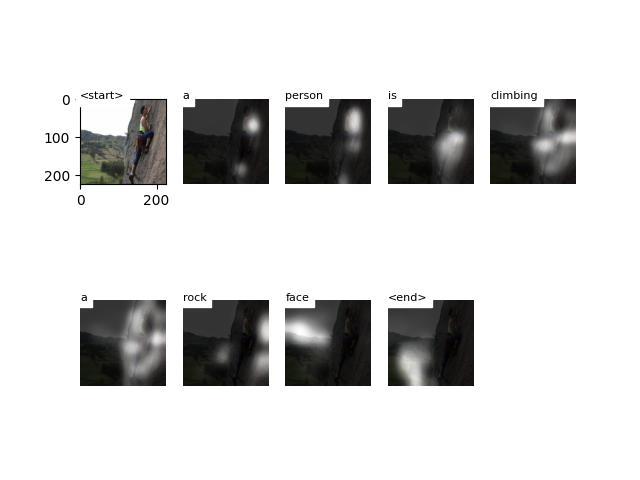
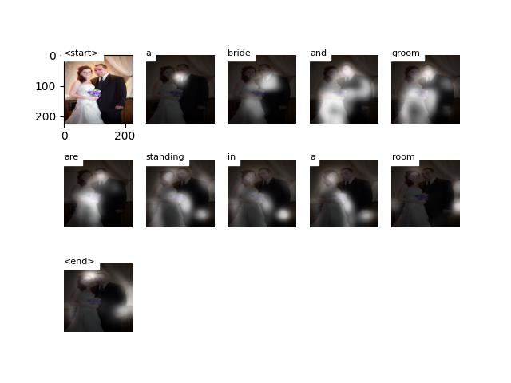
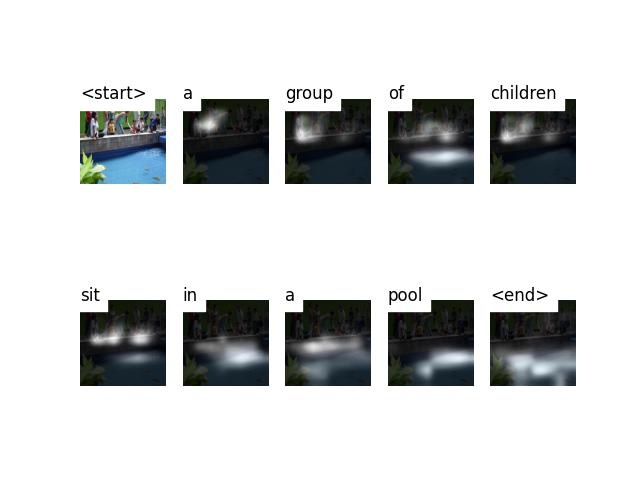

# Image_captioning_with_Attention
- The model addresses the task of automatically generating captions for images by attending to different regions of the image while generating each word of the caption.

- **Resnet** model is used for encoding the images.
- **LSTM** cells with attention are used as decoder for generating the caption of the image.

## Model

## Results
  
  
  
  
  
  

  
